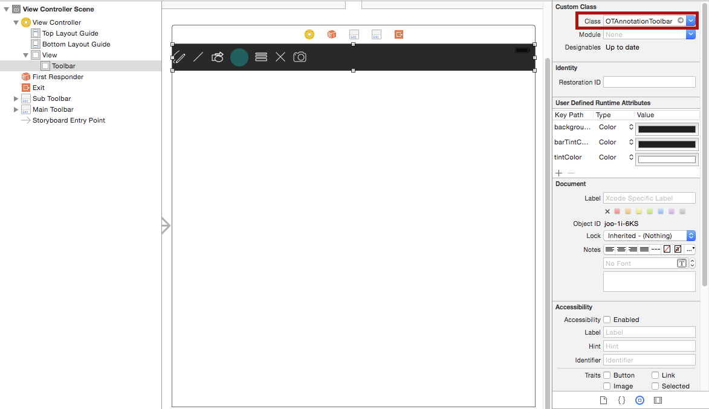
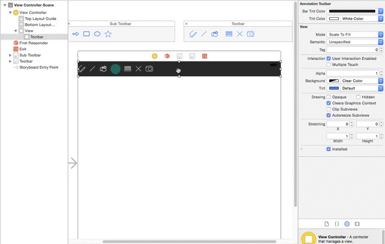
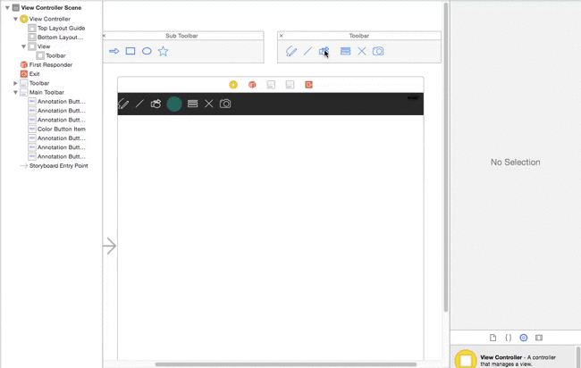

OpenTok iOS Annotations Plugin -- Beta
===========================

The Annotations plugin adds annotation and frame grab capabilities to OpenTok for iOS. It's written in Objective C but also offers Interface Builder support. 

As a beta, this code is subject to change. Pull requests are welcome. You can also email feedback to collaboration-tools-beta-program@tokbox.com.


Requirements
-----

Review the basic requirements for [OpenTok](https://tokbox.com/developer/requirements/) and the [OpenTok iOS SDK](https://tokbox.com/developer/sdks/ios/#system-requirements).

Prerequisites
-----

* Version 2.7, 2.6, or 2.5 of [OpenTok iOS SDK](https://tokbox.com/developer/sdks/ios/): latest version is preferred
* An Xcode project that uses the OpenTok iOS SDK

PRO TIP: If you don't already have a project, grab the [OpenTok iOS SDK samples](https://github.com/opentok/opentok-ios-sdk-samples) for a quick start.

Adding the plugin to your project
----------

You can add the plugin using CocoaPods or manually.

### CocoaPods

1. Add `pod 'OpenTokAnnotations', :git => 'https://github.com/opentok/annotation-component-ios.git'` to your podfile.
2. Run `pod install` from a terminal prompt or using an Xcode plugin.

### Manually add the framework

1. Download and unzip the latest [OpenTokAnnotations.framework.zip file](https://github.com/opentok/annotation-component-ios/releases).
2. Click your project name in the Project Navigator sidebar.
3. Choose the General tab.
4. Expand the Embedded Binaries section.
5. Click the '+' sign to add a framework.
6. Select 'Add Other...' from the popup and navigate to folder you unzipped in step 1.
7. Check "Copy items if needed" and click Finish.
8. Click on 'OpenTokAnnotations.framework' in the Project navigator window and ensure that your application is checked and set to 'required' under Target Membership in File inspector.

Adding the toolbar to your project
----------------

### Using Interface Builder
Open `Main.storyboard` and drag a `UIView` component into the main view. With the view selected, click on the 'Identity inspector' tab (part of Utilities) and change the class to 'OTAnnotationToolbar'. You should see the view update to the default toolbar layout. 



### In Objective C
To use the toolbar in your code, add the following line to your `ViewController.m` file and link the OpenTok toolbar you just created in Interface Builder:

```objective-c
@implementation ViewController {
    ...

    IBOutlet OTAnnotationToolbar* _toolbar;

    ...
}
```
Linking the toolbar to a published stream
-------------------
Create a new `OTAnnotationView` instance in the `doPublish` method (called by the `sessionDidConnect:` method from the `OTSessionDelegate`) and link it to the toolbar.

```objective-c
- (void)doPublish
{
    ...

    OTAnnotationView* annotationView = [[OTAnnotationView alloc] initWithPublisher:_publisher];
    [_publisher.view addSubview:annotationView];

    [_toolbar attachAnnotationView: annotationView];
}
```
Linking the toolbar to a subscribed stream
-----------------
Similarly, an annotation view can be added to an incoming subscriber feed in the `subscriberDidConnectToStream:` method from the `OTSubscriberKitDelegate`.

```objective-c
- (void)subscriberDidConnectToStream:(OTSubscriberKit*)subscriber
{
    ...

    OTAnnotationView* annotationView = [[OTAnnotationView alloc] initWithSubscriber:_subscriber];
    [_subscriber.view.superview addSubview:annotationView];

    [_toolbar attachAnnotationView: annotationView];
}
```

Grabbing frames
------------

The 'ot_capture' toolbar button allows an individual frame to be captured, including any annotations. The frame image could be a screenshare or a video image: whatever is being streamed at the time of capture. The `UIImage` for these captures can be handled using the following callback from the `OTScreenCaptureDelegate`:

```objective-c
-(void)didCaptureImage:(UIImage *)image forConnection:(NSString *)connectionId {
    // Do something with the image
}
```

Don't forget to add `<OTScreenCaptureDelegate>` to your view controller's .h file and call `_toolbar.screenCaptureDelegate = self;` in your view controller's .m file.

Customizing the toolbar
----------------

### Defaults

Below is a list of default `OTAnnotationButtonItem` identifiers and their corresponding actions:

| id            | Action        |
| ------------- | ------------- |
| ot_pen | Freehand/Pen tool |
| ot_line | Line tool |
| ot_shape | Shapes group/submenu |
| ot_arrow | Arrow tool |
| ot_rectangle | Rectangle tool |
| ot_oval | Oval tool |
| ot_colors | Color picker submenu |
| ot_line_width | Line width picker submenu |
| ot_clear | Clears active user annotations |
| ot_capture | Tap a video frame to capture a screenshot |


### Adding/removing menu items

To create menu items dynamically, you will need to create a new `UIToolbar` instance and hook it up as the `mainToolbar` outlet in your `OTAnnotationToolbar` instance (`_toolbar.mainToolbar = someToolbar`). Toolbar `UIBarButtonItem`s can then be added using the `items` property:

```objective-c
someToolbar.items = arrayOfItems;
```

See [Add menu items using Interface Builder](#ib-menu) to create static menu items through the visual interface.

The `OTAnnotationButtonItem` class provides an `identifier` property that allows a string to be associated with the button for use on delegate callback (or you can use the `tag` property associated with all `UIView`s.

*Info: You may want to add* `[self.view bringSubviewToFront:_toolbar];` *to ensure the toolbar is always drawn on top.*

### <a name="ib-menu"></a>Add menu items using Interface Builder

OTAnnotations provides Interface Builder support to add custom toolbars and button items. 

#### Link a main toolbar


#### Link a sub toolbar to an `OTAnnotationButtonItem`


### Handling custom items

Custom added toolbar items will fire the `didTapItem` callback if the `OTAnnotationToolbarDelegate` is configured in your view controller. Add `<OTAnnotationToolbarDelegate>` to your ViewController.h file and be sure to set `_toolbar.delegate = self;`. Then, add the method below to your view controller implementation file:

```objective-c
-(void)didTapItem:(UIBarButtonItem *)item {
    if ([item isKindOfClass:OTAnnotationButtonItem.class]) {
        NSArray* star = [NSArray arrayWithObjects:
            [NSValue valueWithCGPoint: CGPointMake(0.5f + 0.5f*cos(degreesToRadians(90)), 0.5f + 0.5f*sin(degreesToRadians(90)))],
            [NSValue valueWithCGPoint: CGPointMake(0.5f + 0.25f*cos(degreesToRadians(126)), 0.5f + 0.25f*sin(degreesToRadians(126)))],
            [NSValue valueWithCGPoint: CGPointMake(0.5f + 0.5f*cos(degreesToRadians(162)), 0.5f + 0.5f*sin(degreesToRadians(162)))],
            [NSValue valueWithCGPoint: CGPointMake(0.5f + 0.25f*cos(degreesToRadians(198)), 0.5f + 0.25f*sin(degreesToRadians(198)))],
            [NSValue valueWithCGPoint: CGPointMake(0.5f + 0.5f*cos(degreesToRadians(234)), 0.5f + 0.5f*sin(degreesToRadians(234)))],
            [NSValue valueWithCGPoint: CGPointMake(0.5f + 0.25f*cos(degreesToRadians(270)), 0.5f + 0.25f*sin(degreesToRadians(270)))],
            [NSValue valueWithCGPoint: CGPointMake(0.5f + 0.5f*cos(degreesToRadians(306)), 0.5f + 0.5f*sin(degreesToRadians(306)))],
            [NSValue valueWithCGPoint: CGPointMake(0.5f + 0.25f*cos(degreesToRadians(342)), 0.5f + 0.25f*sin(degreesToRadians(342)))],
            [NSValue valueWithCGPoint: CGPointMake(0.5f + 0.5f*cos(degreesToRadians(18)), 0.5f + 0.5f*sin(degreesToRadians(18)))],
            [NSValue valueWithCGPoint: CGPointMake(0.5f + 0.25f*cos(degreesToRadians(54)), 0.5f + 0.25f*sin(degreesToRadians(54)))],
            [NSValue valueWithCGPoint: CGPointMake(0.5f + 0.5f*cos(degreesToRadians(90)), 0.5f + 0.5f*sin(degreesToRadians(90)))], nil];

        // Add points to custom action items
        if ([((OTAnnotationButtonItem*) item).identifier isEqualToString:@"custom_star"]) {
            [(OTAnnotationButtonItem*) item setPoints:star];
        }
    }
}
```

The example above tests for an `OTAnnotationButtonItem`, which allows a set of points to be defined as the action and will draw the result of those points on the screen as the user interacts with it.

### Custom colors

To add a new color palette to be used with annotations, call `setColors:` on the toolbar instance.

```objective-c
NSArray* colors = [NSArray arrayWithObjects:
    [UIColor blueColor],
    [UIColor redColor],
    [UIColor greenColor],
    [UIColor orangeColor],
    [UIColor yellowColor],
    [UIColor purpleColor],
    [UIColor brownColor],
    nil];

[_toolbar setColors:colors];
```

To add a new color to the existing palette, call `addColor:` on the toolbar instance.

```objective-c
[_toolbar addColor:[UIColor cyanColor]];
```

Cross-platform compatibility notes
----------------

In order to ensure that all annotations aren't cut off across devices, we recommend:
* Using predefined aspect ratios for your video frames. 
* Using the same aspect ratio across device platforms.

The following code samples illustrate how to set the aspect ratios within an iOS app. 

```objective-c
...

[_subscriber.view setFrame:CGRectMake(x, y, width, height)];

...

[_publisher.view setFrame:CGRectMake(x, y, scale*width, scale*height)];
```

See the repos for the [Android](https://github.com/opentok/annotation-component-android#for-best-results) and [JavaScript](https://github.com/opentok/annotation-component-web#for-best-results) annotation plugins for information specific to these platforms.
